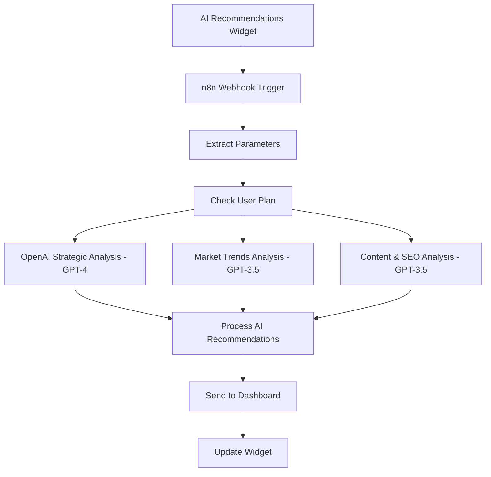

# 🤖 AI Recommendations n8n Workflow Setup Guide

## 📋 Workflow Overview

This n8n workflow integrates with your **AI Recommendations Widget** to provide:
- **AI-powered business analysis** using OpenAI GPT models
- **Strategic recommendations** with implementation roadmaps
- **Market trend analysis** and competitive insights
- **Content strategy suggestions** and SEO recommendations
- **Tiered AI features** (Basic vs Premium plans)

## 🔗 AI Services Required

### API Credentials Needed:
1. **OpenAI API** - GPT-4 for strategic analysis, GPT-3.5 for market/content insights
2. **Optional integrations**:
   - Google Analytics (for data-driven recommendations)
   - SEMrush/Ahrefs (for competitive analysis context)
   - Social media APIs (for content strategy enhancement)

### Plan-Based AI Features:
- **Basic Plan**: GPT-3.5, 5-7 recommendations, monthly updates
- **Premium Plan**: GPT-4, 10-15 recommendations, weekly updates, custom analysis

## 🚀 Setup Instructions

### 1. Import Workflow to n8n
```bash
# Copy the ai-recommendations-workflow.json
# Import in n8n: Settings → Import from File
```

### 2. Configure API Credentials
In n8n Credentials section, add:

```javascript
// OpenAI API
{
  "name": "openAiApi",
  "type": "openAiApi",
  "data": {
    "apiKey": "YOUR_OPENAI_API_KEY"
  }
}

// Optional: Google Analytics (for data-driven insights)
{
  "name": "googleAnalyticsApi",
  "type": "googleAnalyticsOAuth2Api",
  "data": {
    "accessToken": "YOUR_GA_ACCESS_TOKEN",
    "viewId": "YOUR_GA_VIEW_ID"
  }
}
```

### 3. Activate Webhook
- **Webhook URL**: `https://your-n8n-instance.com/webhook/ai-recommendations`
- **Method**: POST
- **Test URL**: Use n8n test webhook feature

### 4. Dashboard Integration
Update your dashboard webhook service to call:

```javascript
// In webhookIntegration.js
const triggerAIRecommendations = async (businessDomain, userPlan, currentData = {}) => {
  const response = await fetch('https://your-n8n-instance.com/webhook/ai-recommendations', {
    method: 'POST',
    headers: { 'Content-Type': 'application/json' },
    body: JSON.stringify({
      business_domain: businessDomain,
      analysis_type: 'comprehensive',
      user_plan: userPlan,
      current_data: currentData,
      focus_areas: 'seo,content,marketing,performance',
      webhook_callback: 'http://localhost:3001/api/webhooks/ai-recommendations-update'
    })
  });
  return response.json();
};
```

## 📊 Data Flow



## 🎛️ Plan-Based AI Features

### Basic Plan (Free/Limited)
- **GPT-3.5 Turbo** for analysis
- **5-7 recommendations** per analysis
- **Monthly AI updates**
- **Basic market insights** (3-4 items)
- **Simple content suggestions** (5-6 ideas)

### Premium Plan  
- **GPT-4** for strategic analysis
- **10-15 detailed recommendations** with ROI estimates
- **Weekly AI updates**
- **Advanced market analysis** (5-7 insights)
- **Comprehensive content strategy** (10-12 ideas)
- **Custom business domain analysis**
- **Implementation roadmaps**

## 📈 Output Data Structure

The workflow returns this data structure to match your AIRecommendationsWidget:

```javascript
{
  "recommendations": [
    {
      "id": 1,
      "title": "Optimize Core Web Vitals",
      "description": "Improve page loading speed and user experience metrics to boost search rankings",
      "category": "performance",
      "priority": "high",
      "implementation_steps": [
        "Audit current page speed",
        "Optimize images and assets",
        "Implement lazy loading",
        "Minimize JavaScript execution"
      ],
      "expected_outcome": "Improve search rankings and user experience",
      "timeline_weeks": 2,
      "roi_estimate": "15-25%",
      "difficulty": "medium"
    }
  ],
  "market_insights": [
    {
      "id": 1,
      "type": "opportunity",
      "title": "AI-Powered Automation Trend",
      "description": "Growing demand for AI-powered business automation solutions",
      "impact_level": "high",
      "action_required": "Integrate AI features into your service offerings"
    }
  ],
  "content_strategy": [
    {
      "id": 1,
      "content_type": "blog_post",
      "title": "Ultimate Guide to Digital Marketing Automation",
      "target_keywords": ["marketing automation", "digital marketing guide"],
      "estimated_traffic_boost": "15-25%",
      "difficulty": "medium",
      "priority": "high"
    }
  ],
  "ai_insights": {
    "total_recommendations": 8,
    "high_priority_items": 3,
    "avg_implementation_time": "4 weeks",
    "focus_categories": ["performance", "content", "marketing", "seo"],
    "estimated_impact": "Medium to High",
    "confidence_score": 87
  },
  "alerts": [
    {
      "type": "action_required",
      "message": "3 high-priority recommendations require immediate attention",
      "severity": "high",
      "timestamp": "2024-01-01T12:00:00Z"
    }
  ],
  "analysis_metadata": {
    "timestamp": "2024-01-01T12:00:00Z",
    "business_domain": "digital_marketing",
    "user_plan": "premium",
    "analysis_type": "comprehensive",
    "focus_areas": ["seo", "content", "marketing", "performance"],
    "ai_models_used": ["gpt-4", "gpt-3.5-turbo"],
    "confidence_level": "high",
    "next_analysis": "2024-01-08T12:00:00Z"
  },
  "premium_features": {
    "available": true,
    "features": [
      "Advanced AI analysis with GPT-4",
      "Unlimited recommendations",
      "Detailed implementation roadmaps",
      "ROI tracking and forecasting",
      "Weekly AI insights updates",
      "Custom business domain analysis",
      "Priority email support",
      "Integration with business tools"
    ]
  }
}
```

## ⚙️ Customization Options

### Modify AI Prompts
```javascript
// In OpenAI nodes, customize the system prompts:
const strategicPrompt = `You are an AI business consultant specializing in ${businessDomain}. 
Focus on actionable recommendations with measurable outcomes. 
Prioritize high-impact, low-effort solutions for immediate wins.`;

const marketPrompt = `Analyze current market trends for ${businessDomain}. 
Identify emerging opportunities and potential threats. 
Consider industry disruption patterns and competitive landscape.`;
```

### Adjust Recommendation Categories  
```javascript
// Customize focus areas based on business type
const focusAreasByDomain = {
  'ecommerce': ['conversion_optimization', 'product_marketing', 'customer_retention'],
  'saas': ['user_onboarding', 'feature_adoption', 'churn_reduction'],
  'consulting': ['thought_leadership', 'lead_generation', 'referral_systems'],
  'local_business': ['local_seo', 'review_management', 'community_engagement']
};
```

### Custom ROI Calculations
```javascript
// Implement business-specific ROI estimation
const calculateROI = (recommendation, businessMetrics) => {\n  const impactFactors = {\n    'performance': businessMetrics.traffic * 0.15,\n    'content': businessMetrics.organic_traffic * 0.25,\n    'marketing': businessMetrics.conversion_rate * 2.0\n  };\n  \n  return impactFactors[recommendation.category] || '10-20%';\n};
```

## 🚨 AI Response Handling

The workflow includes robust AI response parsing:
- **JSON extraction** from natural language responses
- **Fallback recommendations** if AI calls fail
- **Response validation** and error handling
- **Token limit management** by plan type

## 📝 Testing

### Test the Webhook
```bash
curl -X POST https://your-n8n-instance.com/webhook/ai-recommendations \
  -H "Content-Type: application/json" \
  -d '{
    "business_domain": "digital_marketing",
    "analysis_type": "comprehensive",
    "user_plan": "premium",
    "focus_areas": "seo,content,marketing,performance",
    "current_data": {
      "monthly_traffic": 50000,
      "conversion_rate": 2.1,
      "bounce_rate": 45
    }
  }'
```

### Expected Response
```javascript
{
  "status": "success",
  "message": "AI recommendations analysis completed successfully",
  "recommendations_count": 12,
  "high_priority_count": 4,
  "execution_time": "2024-01-01T12:00:00Z"
}
```

## 🔐 AI Safety & Ethics

### Content Filtering
- Recommendations are business-focused and ethical
- No harmful or manipulative suggestions
- Compliance with AI usage policies
- Transparent about AI-generated content

### Data Privacy
- No sensitive business data stored in AI calls
- Anonymized metrics for analysis
- Secure API credential handling
- GDPR-compliant data processing

## 💡 AI Model Usage Strategy

### GPT-4 (Premium Only)
- **Strategic analysis** requiring deep reasoning
- **Complex business problem solving**
- **Multi-factor recommendation synthesis**
- **High-stakes business decisions**

### GPT-3.5 Turbo (All Plans)
- **Market trend analysis**
- **Content idea generation**
- **SEO recommendations**
- **Quick tactical suggestions**

## 🔄 Next Steps

1. **Import and test** this workflow in n8n
2. **Configure OpenAI API** credentials securely  
3. **Connect to dashboard** using webhook integration
4. **Test with basic plan** user first
5. **Verify premium AI features** work correctly
6. **Customize AI prompts** for your business domain
7. **Set up monitoring** for AI response quality
8. **Train your team** on interpreting AI recommendations

This workflow transforms your dashboard into an AI-powered business intelligence platform - customize the prompts, categories, and analysis focus based on your specific industry and customer needs!