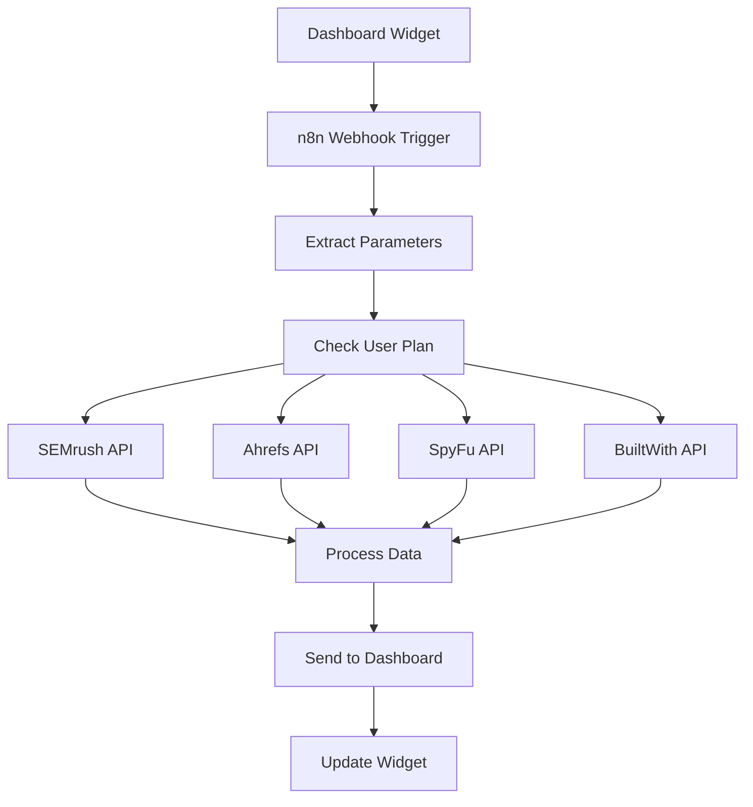

# 🎯 Competitor Monitoring n8n Workflow Setup Guide

## 📋 Workflow Overview

This n8n workflow integrates with your **Competitor Monitoring Widget** to provide:
- **Real-time competitor analysis** using multiple data sources
- **Tiered features** (Basic vs Premium plans)
- **Automated data processing** and dashboard updates
- **Smart threat assessment** and alerting

## 🔗 Data Sources Required

### API Credentials Needed:
1. **SEMrush API** - Organic competitor data
2. **Ahrefs API** - Backlink analysis  
3. **SpyFu API** - Competitor intelligence
4. **BuiltWith API** - Technology stack detection

### Alternative Free/Budget Options:
- Replace SEMrush with **Serpstack** or **DataForSEO**
- Replace Ahrefs with **Moz API** or **Majestic**
- Use **Wappalyzer** instead of BuiltWith for tech stack

## 🚀 Setup Instructions

### 1. Import Workflow to n8n
```bash
# Copy the competitor-monitoring-workflow.json
# Import in n8n: Settings → Import from File
```

### 2. Configure API Credentials
In n8n Credentials section, add:
```javascript
// SEMrush API
{
  "name": "semrushApi",
  "type": "httpHeaderAuth", 
  "data": {
    "apiKey": "YOUR_SEMRUSH_API_KEY"
  }
}

// Ahrefs API  
{
  "name": "ahrefsApi",
  "type": "httpHeaderAuth",
  "data": {
    "apiKey": "YOUR_AHREFS_API_KEY"
  }
}

// SpyFu API
{
  "name": "spyfuApi", 
  "type": "httpHeaderAuth",
  "data": {
    "apiKey": "YOUR_SPYFU_API_KEY"
  }
}

// BuiltWith API
{
  "name": "builtWithApi",
  "type": "httpHeaderAuth", 
  "data": {
    "apiKey": "YOUR_BUILTWITH_API_KEY"
  }
}
```

### 3. Activate Webhook
- **Webhook URL**: `https://your-n8n-instance.com/webhook/competitor-monitoring`
- **Method**: POST
- **Test URL**: Use n8n test webhook feature

### 4. Dashboard Integration
Update your dashboard webhook service to call:
```javascript
// In webhookIntegration.js
const triggerCompetitorAnalysis = async (domain, competitors, userPlan) => {
  const response = await fetch('https://your-n8n-instance.com/webhook/competitor-monitoring', {
    method: 'POST',
    headers: { 'Content-Type': 'application/json' },
    body: JSON.stringify({
      target_domain: domain,
      competitors: competitors,
      analysis_type: 'full',
      user_plan: userPlan,
      webhook_callback: 'http://localhost:3001/api/webhooks/competitor-update'
    })
  });
  return response.json();
};
```

## 📊 Data Flow



## 🎛️ Plan-Based Features

### Basic Plan (Free/Low Cost)
- **3 competitors max**
- **10 organic keywords**
- **20 backlinks** 
- **Weekly updates only**
- **Basic threat assessment**

### Premium Plan  
- **Unlimited competitors**
- **50+ organic keywords**
- **100+ backlinks**
- **Real-time updates**
- **Advanced threat scoring**
- **Historical data**
- **Custom alerts**

## 📈 Output Data Structure

The workflow returns this data structure to your dashboard:

```javascript
{
  "competitors": [
    {
      "domain": "competitor1.com",
      "ranking": 1,
      "change": "+2", 
      "threat_level": "high",
      "market_share": "23%",
      "organic_keywords": 15420,
      "organic_traffic": 125000,
      "recent_changes": ["SEO optimization detected"],
      "tech_stack": ["React", "AWS", "Stripe"]
    }
  ],
  "alerts": [
    {
      "type": "ranking_change",
      "competitor": "competitor1.com", 
      "message": "Moved up 3 positions",
      "severity": "medium",
      "timestamp": "2024-01-01T12:00:00Z"
    }
  ],
  "summary": {
    "total_tracked": 12,
    "high_threat": 3,
    "new_changes": 8,
    "analysis_confidence": 92
  },
  "analysis_metadata": {
    "timestamp": "2024-01-01T12:00:00Z",
    "user_plan": "premium", 
    "refresh_interval": "1h"
  }
}
```

## ⚙️ Customization Options

### Modify Competitor Sources
```javascript
// In the JavaScript Code node, adjust data sources:
const dataSources = [
  'semrush',    // Organic competitors
  'ahrefs',     // Backlink competitors  
  'spyfu',      // Paid search competitors
  'similarweb'  // Traffic competitors (add if needed)
];
```

### Adjust Update Frequency
```javascript
// Set different refresh intervals by plan
const refreshInterval = {
  basic: '6h',      // 6 hours
  premium: '1h',    // 1 hour  
  enterprise: '15m' // 15 minutes
};
```

### Custom Threat Scoring
```javascript
// Modify threat assessment logic
const calculateThreatLevel = (competitor) => {
  const score = 
    (competitor.organic_traffic * 0.3) +
    (competitor.backlinks * 0.2) + 
    (competitor.keyword_overlap * 0.5);
    
  if (score > 80) return 'high';
  if (score > 50) return 'medium'; 
  return 'low';
};
```

## 🚨 Error Handling

The workflow includes comprehensive error handling:
- **API rate limiting** - Automatic retry with backoff
- **Invalid domains** - Validation and error response
- **Missing data** - Fallback to cached data
- **Webhook failures** - Error logging and alerts

## 📝 Testing

### Test the Webhook
```bash
curl -X POST https://your-n8n-instance.com/webhook/competitor-monitoring \
  -H "Content-Type: application/json" \
  -d '{
    "target_domain": "example.com",
    "competitors": "competitor1.com,competitor2.com",
    "analysis_type": "full", 
    "user_plan": "premium"
  }'
```

### Expected Response
```javascript
{
  "status": "success",
  "message": "Competitor analysis completed successfully",
  "competitors_analyzed": 3,
  "execution_time": "2024-01-01T12:00:00Z"
}
```

## 🔄 Next Steps

1. **Import and test** this workflow in n8n
2. **Configure API credentials** for your data sources  
3. **Connect to dashboard** using webhook integration
4. **Test with basic plan** user first
5. **Verify premium features** work correctly
6. **Set up monitoring** and error alerts

This workflow serves as a template - customize the data sources, processing logic, and output format based on your specific needs!