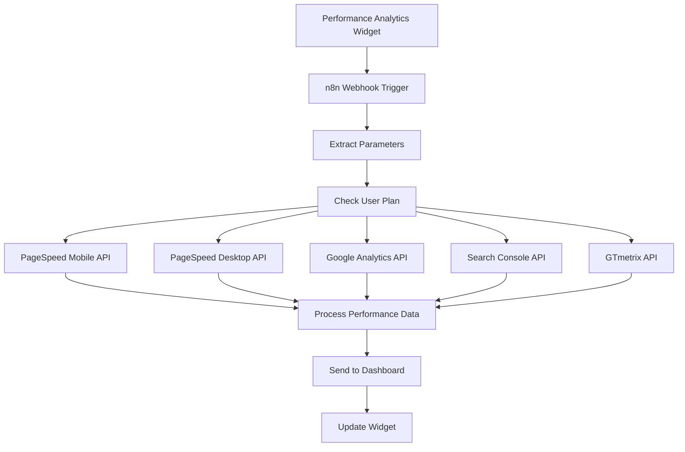

# 🚀 Performance Analytics n8n Workflow Setup Guide

## 📋 Workflow Overview

This n8n workflow integrates with your **Performance Analytics Widget** to provide:
- **Comprehensive website performance monitoring** using multiple data sources
- **Core Web Vitals tracking** (LCP, FID, CLS)
- **Tiered features** (Basic vs Premium plans)
- **Real-time performance scoring** and alerting
- **Google Analytics & Search Console integration**

## 🔗 Data Sources Required

### API Credentials Needed:
1. **Google PageSpeed Insights API** - Core Web Vitals and performance metrics
2. **Google Analytics API** - Traffic and user behavior data  
3. **Google Search Console API** - Search performance and click data
4. **GTmetrix API** - Additional performance testing (optional)

### Free vs Premium Data Limits:
- **Basic Plan**: 7 days data, 3 top pages, basic alerts
- **Premium Plan**: 30 days data, unlimited pages, advanced alerts

## 🚀 Setup Instructions

### 1. Import Workflow to n8n
```bash
# Copy the performance-analytics-workflow.json
# Import in n8n: Settings → Import from File
```

### 2. Configure API Credentials
In n8n Credentials section, add:

```javascript
// Google PageSpeed Insights API
{
  "name": "googlePageSpeedApi",
  "type": "httpHeaderAuth", 
  "data": {
    "apiKey": "YOUR_GOOGLE_API_KEY"
  }
}

// Google Analytics API  
{
  "name": "googleAnalyticsApi",
  "type": "googleAnalyticsOAuth2Api",
  "data": {
    "accessToken": "YOUR_GA_ACCESS_TOKEN",
    "viewId": "YOUR_GA_VIEW_ID"
  }
}

// Google Search Console API
{
  "name": "googleSearchConsoleApi", 
  "type": "googleSearchConsoleOAuth2Api",
  "data": {
    "accessToken": "YOUR_GSC_ACCESS_TOKEN"
  }
}

// GTmetrix API (Optional)
{
  "name": "gtmetrixApi",
  "type": "httpHeaderAuth",
  "data": {
    "apiKey": "YOUR_GTMETRIX_API_KEY"
  }
}
```

### 3. Activate Webhook
- **Webhook URL**: `https://your-n8n-instance.com/webhook/performance-analytics`
- **Method**: POST
- **Test URL**: Use n8n test webhook feature

### 4. Dashboard Integration
Update your dashboard webhook service to call:

```javascript
// In webhookIntegration.js
const triggerPerformanceAnalysis = async (targetUrl, userPlan) => {
  const response = await fetch('https://your-n8n-instance.com/webhook/performance-analytics', {
    method: 'POST',
    headers: { 'Content-Type': 'application/json' },
    body: JSON.stringify({
      target_url: targetUrl,
      analysis_type: 'full',
      user_plan: userPlan,
      metrics_requested: 'all',
      webhook_callback: 'http://localhost:3001/api/webhooks/analytics-update'
    })
  });
  return response.json();
};
```

## 📊 Data Flow



## 🎛️ Plan-Based Features

### Basic Plan (Free/Low Cost)
- **7 days** data retention
- **3 top pages** analysis
- **Basic Core Web Vitals**
- **2 performance alerts max**
- **Weekly analysis only**

### Premium Plan  
- **30 days** data retention
- **Unlimited pages** analysis
- **Advanced Core Web Vitals tracking**
- **Unlimited alerts & recommendations**
- **Hourly analysis**
- **Historical trends**
- **Custom date ranges**

## 📈 Output Data Structure

The workflow returns this data structure to match your PerformanceAnalyticsWidget:

```javascript
{
  "website": {
    "overall_score": 87,
    "traffic_trend": "+12%",
    "bounce_rate": "34.2%",
    "avg_session": "2:34",
    "conversion_rate": "2.1%",
    "page_speed": 85,
    "mobile_score": 82,
    "desktop_score": 88,
    "avg_load_time": 2.1,
    "core_web_vitals": {
      "lcp": "1.8",
      "fid": "45.2", 
      "cls": "0.089"
    }
  },
  "metrics": {
    "organic_traffic": 24580,
    "page_views": 45230,
    "unique_visitors": 18940,
    "goal_completions": 145,
    "top_pages": [
      {
        "page": "/landing-page",
        "views": 4820,
        "bounce": "28%",
        "ctr": "3.2%"
      }
    ]
  },
  "alerts": [
    {
      "type": "performance",
      "message": "Page load time is slow (3.2s). Target: <3s",
      "severity": "medium",
      "timestamp": "2024-01-01T12:00:00Z"
    }
  ],
  "recommendations": [
    "Optimize images and enable compression",
    "Implement browser caching",
    "Improve Largest Contentful Paint (LCP)"
  ],
  "analysis_metadata": {
    "timestamp": "2024-01-01T12:00:00Z",
    "target_url": "https://example.com",
    "user_plan": "premium", 
    "time_range": "30d",
    "data_sources": ["google_pagespeed", "google_analytics", "search_console", "gtmetrix"],
    "refresh_interval": "1h"
  },
  "premium_features": {
    "available": true,
    "features": [
      "Unlimited historical data",
      "Custom dashboard builder",
      "Advanced conversion tracking",
      "Real-time monitoring & alerts",
      "Core Web Vitals tracking",
      "Custom date ranges",
      "Performance optimization suggestions",
      "API integrations & exports"
    ]
  }
}
```

## ⚙️ Customization Options

### Modify Performance Thresholds
```javascript
// In the JavaScript Code node, adjust performance scoring:
const calculatePerformanceScore = (vitals) => {
  let score = 100;
  if (vitals.lcp > 2500) score -= 25;  // LCP threshold
  if (vitals.fid > 100) score -= 20;   // FID threshold  
  if (vitals.cls > 0.1) score -= 15;   // CLS threshold
  return Math.max(score, 0);
};
```

### Adjust Alert Conditions  
```javascript
// Custom alert thresholds by plan
const alertThresholds = {
  basic: {
    performance_score: 60,
    load_time: 4,
    bounce_rate: 80
  },
  premium: {
    performance_score: 70,
    load_time: 3,
    bounce_rate: 60
  }
};
```

### Core Web Vitals Scoring
```javascript
// Customize Core Web Vitals evaluation
const evaluateCoreWebVitals = (lcp, fid, cls) => {
  const scores = {
    lcp: lcp <= 2500 ? 'good' : lcp <= 4000 ? 'needs-improvement' : 'poor',
    fid: fid <= 100 ? 'good' : fid <= 300 ? 'needs-improvement' : 'poor', 
    cls: cls <= 0.1 ? 'good' : cls <= 0.25 ? 'needs-improvement' : 'poor'
  };
  return scores;
};
```

## 🚨 Error Handling

The workflow includes comprehensive error handling:
- **API rate limiting** - Automatic retry with exponential backoff
- **Invalid URLs** - URL validation and error response
- **Missing GA data** - Fallback to simulated metrics
- **Webhook failures** - Error logging and dashboard alerts

## 📝 Testing

### Test the Webhook
```bash
curl -X POST https://your-n8n-instance.com/webhook/performance-analytics \
  -H "Content-Type: application/json" \
  -d '{
    "target_url": "https://example.com",
    "analysis_type": "full", 
    "user_plan": "premium",
    "metrics_requested": "all"
  }'
```

### Expected Response
```javascript
{
  "status": "success",
  "message": "Performance analysis completed successfully",
  "overall_score": 87,
  "execution_time": "2024-01-01T12:00:00Z"
}
```

## 📊 Performance Metrics Explained

### Core Web Vitals
- **LCP (Largest Contentful Paint)**: Loading performance - should be ≤2.5s
- **FID (First Input Delay)**: Interactivity - should be ≤100ms  
- **CLS (Cumulative Layout Shift)**: Visual stability - should be ≤0.1

### PageSpeed Scores
- **Mobile/Desktop Scores**: 0-100 scale from Google PageSpeed Insights
- **Overall Score**: Average of mobile and desktop scores

### Traffic Metrics
- **Organic Traffic**: Sessions from search engines
- **Page Views**: Total page views in time period
- **Bounce Rate**: Percentage of single-page sessions
- **Avg Session Duration**: Average time spent on site

## 🔄 Next Steps

1. **Import and test** this workflow in n8n
2. **Configure Google API credentials** (PageSpeed, Analytics, Search Console)  
3. **Connect to dashboard** using webhook integration
4. **Test with basic plan** user first
5. **Verify premium features** work correctly
6. **Set up monitoring** and performance alerts
7. **Customize thresholds** based on your KPIs

This workflow serves as the backbone for real-time performance monitoring - customize the metrics, thresholds, and alerts based on your specific business needs!