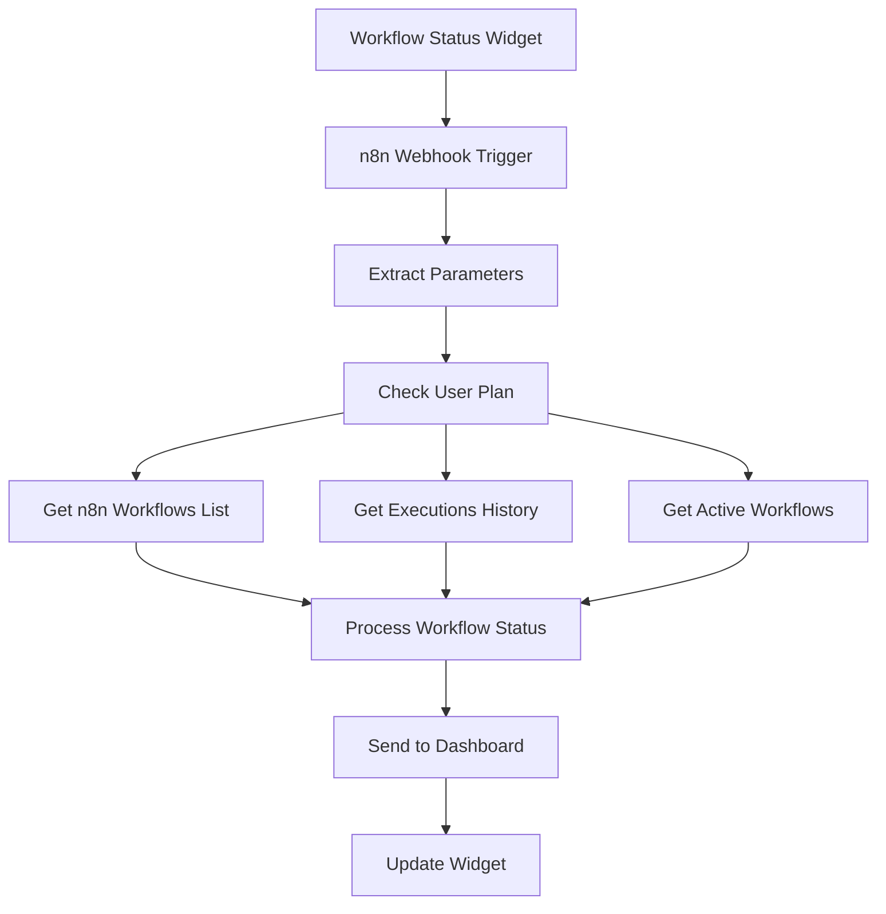

# 📊 Workflow Status n8n Monitoring Setup Guide

## 📋 Workflow Overview

This n8n workflow integrates with your **Workflow Status Widget** to provide:
- **Real-time monitoring** of all dashboard automation workflows
- **Execution history** and performance analytics
- **Health scoring** and alert management
- **System overview** with resource usage tracking
- **Tiered monitoring features** (Basic vs Premium plans)

## 🔗 Monitoring Sources Required

### API Credentials Needed:
1. **n8n API** - For accessing workflow status, executions, and active workflows
2. **Optional integrations**:
   - Prometheus/Grafana (for advanced system metrics)
   - PagerDuty/Slack (for alert notifications)
   - Custom monitoring endpoints

### Plan-Based Monitoring Features:
- **Basic Plan**: 15min refresh, 20 execution history, basic alerts
- **Premium Plan**: 5min refresh, 100+ execution history, advanced analytics

## 🚀 Setup Instructions

### 1. Import Workflow to n8n
```bash
# Copy the workflow-status-workflow.json
# Import in n8n: Settings → Import from File
```

### 2. Configure n8n API Credentials
In n8n Credentials section, add:

```javascript
// n8n API Credentials
{
  "name": "n8nApi",
  "type": "httpHeaderAuth",
  "data": {
    "baseUrl": "https://your-n8n-instance.com",
    "apiKey": "YOUR_N8N_API_KEY"
  }
}
```

### 3. Generate n8n API Key
In your n8n instance:
```bash
# Go to Settings → Personal Access Tokens
# Create new token with permissions:
# - workflow:read
# - execution:read  
# - activeWorkflows:read
```

### 4. Activate Webhook
- **Webhook URL**: `https://your-n8n-instance.com/webhook/workflow-status`
- **Method**: POST
- **Test URL**: Use n8n test webhook feature

### 5. Dashboard Integration
Update your dashboard webhook service to call:

```javascript
// In webhookIntegration.js
const triggerWorkflowStatusMonitoring = async (userPlan, includeHistory = false) => {
  const response = await fetch('https://your-n8n-instance.com/webhook/workflow-status', {
    method: 'POST',
    headers: { 'Content-Type': 'application/json' },
    body: JSON.stringify({
      monitoring_type: 'all_workflows',
      user_plan: userPlan,
      requested_workflows: 'competitor-monitoring,performance-analytics,ai-recommendations',
      include_history: includeHistory.toString(),
      alert_threshold: 'medium',
      webhook_callback: 'http://localhost:3001/api/webhooks/workflow-status-update'
    })
  });
  return response.json();
};
```

## 📊 Data Flow



## 🎛️ Plan-Based Monitoring Features

### Basic Plan (Limited Monitoring)
- **15-minute refresh** interval
- **Last 20 executions** history
- **3 alerts maximum**
- **Basic health scoring**
- **Simple performance metrics**

### Premium Plan (Advanced Monitoring)  
- **5-minute refresh** interval
- **Last 100+ executions** history
- **Unlimited alerts**
- **Advanced health analytics**
- **Detailed performance trends**
- **Resource usage monitoring**
- **Custom alert thresholds**

## 📈 Output Data Structure

The workflow returns this data structure to match your WorkflowStatusWidget:

```javascript
{
  "workflows": [
    {
      "id": "workflow-123",
      "name": "Competitor Analysis",
      "display_name": "Competitor Analysis",
      "status": "active",
      "health": "healthy",
      "last_run": "2024-01-01T12:00:00Z",
      "next_run": "Automatic trigger",
      "success_rate": "95%",
      "executions_today": 8,
      "avg_runtime": "45s",
      "health_score": 95,
      "details": {
        "created": "2024-01-01T00:00:00Z",
        "updated": "2024-01-01T11:00:00Z",
        "node_count": 12,
        "total_executions": 150,
        "active": true
      }
    }
  ],
  "system_overview": {
    "total_workflows": 4,
    "active_workflows": 3,
    "healthy_workflows": 4,
    "executions_today": 24,
    "system_health": 87,
    "overall_status": "excellent",
    "uptime_percentage": "99.5%",
    "last_incident": "None"
  },
  "alerts": [
    {
      "type": "workflow_performance",
      "message": "1 workflow(s) showing performance issues",
      "severity": "medium",
      "timestamp": "2024-01-01T12:00:00Z",
      "action_required": "Review and optimize workflow performance"
    }
  ],
  "performance_metrics": {
    "total_executions": 450,
    "avg_runtime": 38.5,
    "execution_trend": [
      {
        "date": "2024-01-01",
        "executions": 15,
        "success_rate": 87
      }
    ],
    "peak_hours": ["09:00-10:00", "14:00-15:00", "18:00-19:00"],
    "resource_usage": {
      "cpu": 35,
      "memory": 45,
      "storage": 15
    }
  },
  "monitoring_metadata": {
    "timestamp": "2024-01-01T12:00:00Z",
    "monitoring_type": "all_workflows",
    "user_plan": "premium",
    "workflows_monitored": 4,
    "data_sources": ["n8n_api", "execution_logs", "active_workflows"],
    "refresh_interval": "5m"
  },
  "premium_features": {
    "available": true,
    "features": [
      "Real-time workflow monitoring",
      "Advanced execution analytics",
      "Custom alert thresholds",
      "Historical performance trends",
      "Detailed error diagnostics",
      "Resource usage monitoring",
      "Custom monitoring dashboards",
      "API integrations for external monitoring"
    ]
  }
}
```

## ⚙️ Customization Options

### Modify Health Scoring Algorithm
```javascript
// In the JavaScript Code node, adjust health calculation:
const calculateHealthScore = (successRate, recentActivity, avgRuntime) => {
  let score = successRate; // Base score from success rate
  
  // Bonus for recent activity
  if (recentActivity > 0) score += 10;
  
  // Penalty for slow runtime (>60s)
  if (avgRuntime > 60) score -= 10;
  
  return Math.min(100, Math.max(0, score));
};
```

### Custom Alert Thresholds  
```javascript
// Customize alert conditions by plan
const alertThresholds = {
  basic: {
    critical_health: 40,
    warning_health: 60,
    max_runtime: 120
  },
  premium: {
    critical_health: 50,
    warning_health: 70,
    max_runtime: 90
  }
};
```

### Workflow Name Mapping
```javascript
// Map technical workflow names to user-friendly names
const workflowDisplayNames = {
  'Competitor Monitoring Workflow': 'Competitor Intelligence',
  'Performance Analytics Workflow': 'Performance Tracker',
  'AI Recommendations Workflow': 'AI Business Advisor',
  'Workflow Status Monitoring Workflow': 'System Monitor'
};
```

## 🚨 Alert Management

### Alert Types and Severity
- **workflow_health** (High): Critical workflow failures
- **workflow_performance** (Medium): Performance degradation
- **workflow_inactive** (Low): Inactive but expected workflows
- **system_resource** (Medium): High resource usage
- **execution_failure** (High): Multiple consecutive failures

### Alert Integration Options
```javascript
// Extend with external alert systems
const sendAlert = async (alert) => {
  // Slack integration
  await fetch('https://hooks.slack.com/your-webhook', {
    method: 'POST',
    body: JSON.stringify({
      text: `🚨 n8n Alert: ${alert.message}`,
      channel: '#automation-alerts'
    })
  });
  
  // Email notification
  if (alert.severity === 'high') {
    await sendEmail({
      to: 'admin@yourcompany.com',
      subject: 'Critical Workflow Alert',
      body: alert.message
    });
  }
};
```

## 📝 Testing

### Test the Webhook
```bash
curl -X POST https://your-n8n-instance.com/webhook/workflow-status \
  -H "Content-Type: application/json" \
  -d '{
    "monitoring_type": "all_workflows",
    "user_plan": "premium",
    "requested_workflows": "competitor-monitoring,performance-analytics,ai-recommendations",
    "include_history": "true",
    "alert_threshold": "medium"
  }'
```

### Expected Response
```javascript
{
  "status": "success",
  "message": "Workflow status monitoring completed successfully",
  "workflows_monitored": 4,
  "system_health": 87,
  "execution_time": "2024-01-01T12:00:00Z"
}
```

## 🔐 Security & Permissions

### n8n API Security
- **Least Privilege**: Only grant necessary permissions
- **API Key Rotation**: Regularly rotate API keys
- **Network Security**: Restrict API access to trusted IPs
- **Audit Logging**: Monitor API usage patterns

### Recommended Permissions
```javascript
// Minimal required permissions for monitoring
{
  "workflow:read": true,
  "execution:read": true, 
  "activeWorkflows:read": true,
  // NOT required:
  "workflow:write": false,
  "execution:write": false
}
```

## 📊 Performance Optimization

### Monitoring Frequency Strategy
```javascript
// Dynamic refresh intervals based on system activity
const getRefreshInterval = (systemHealth, userPlan) => {
  if (systemHealth < 70) return userPlan === 'premium' ? '2m' : '5m'; // More frequent during issues
  if (systemHealth > 90) return userPlan === 'premium' ? '10m' : '30m'; // Less frequent when stable
  return userPlan === 'premium' ? '5m' : '15m'; // Standard intervals
};
```

### Data Caching Strategy
- Cache workflow lists for 30 minutes
- Cache execution history for 5 minutes  
- Real-time data for active workflows only
- Compress historical data for basic plan users

## 🔄 Advanced Features

### Custom Monitoring Dashboards
For premium users, extend monitoring with:
```javascript
// Custom metrics collection
const customMetrics = {
  business_impact: calculateBusinessMetrics(executions),
  cost_analysis: calculateResourceCosts(usage),
  reliability_score: calculateReliabilityMetrics(history),
  automation_roi: calculateROIMetrics(workflows)
};
```

### Integration with External Monitoring
```javascript
// Prometheus metrics export
const exportPrometheusMetrics = (metrics) => {
  return `
# HELP n8n_workflow_executions_total Total workflow executions
n8n_workflow_executions_total{workflow="competitor-monitoring"} ${metrics.total_executions}

# HELP n8n_workflow_success_rate Workflow success rate
n8n_workflow_success_rate{workflow="competitor-monitoring"} ${metrics.success_rate}
  `.trim();
};
```

## 🔄 Next Steps

1. **Import and test** this workflow in n8n
2. **Generate n8n API key** with proper permissions  
3. **Configure API credentials** securely
4. **Connect to dashboard** using webhook integration
5. **Test monitoring** with all workflow types
6. **Set up alerting** for critical issues
7. **Customize health thresholds** for your needs
8. **Monitor performance** and optimize refresh intervals

This workflow provides comprehensive monitoring of your entire n8n automation ecosystem - customize the health scoring, alert thresholds, and performance metrics based on your specific operational requirements!